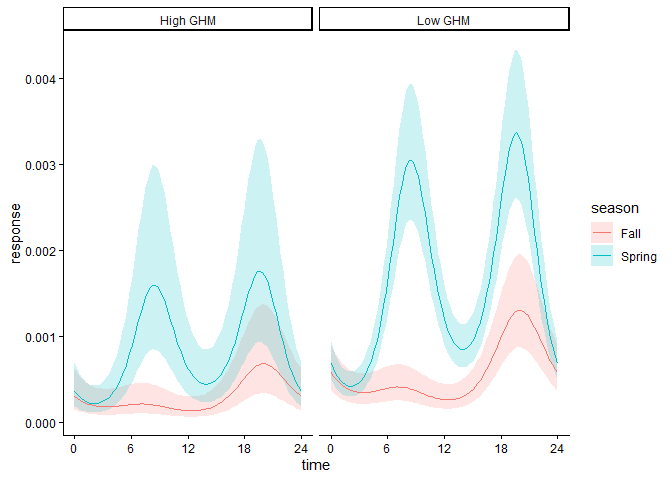

chm_helpers
================

Here is a small set of basic helper functions to streamline the coding
of animal activity analysis using circular hierarchical modelling
[(Ianarilli et
al. 2024)](https://besjournals.onlinelibrary.wiley.com/doi/full/10.1111/1365-2656.14213).

### Functions

- `make_chm_data` creates a dataframe ready for CHM analysis using input
  from [camtrapDP](https://camtrap-dp.tdwg.org) format *deployments* and
  *observations* dataframes
- `chmTMB` fits trigonometric circular (mixed) models using `glmmTMB()`,
  with output class `c("chmTMB", "glmmMB")`
- `predict` predicts activity probabilities across time and covariates,
  generic for `chmTMB` objects

### Example usage

#### Load functions

``` r
source("https://raw.githubusercontent.com/MarcusRowcliffe/make_chm_data/refs/heads/main/chm_helpers.R")
```

#### Load data

In this case including some conversions to camtrapDP v0 format.

``` r
observations <- read.csv("data/species_records.csv") %>%
  droplevels %>% 
  select(-X) %>% 
  mutate(timestamp = ymd_hm(DateTimeOriginal),
         deploymentID = paste(Session, Station, sep="_"))
deployments <- read.csv("data/CameraTrapProject_CT_data_for_analysis_MASTER.csv", as.is = TRUE) %>% 
  select(-X) %>%
  mutate(Date_setup = mdy(Date_setup),
         Date_retr = mdy(Date_retr),
         Problem1_from = mdy(Problem1_from),
         Problem1_to = mdy(Problem1_to),
         deploymentStart = as.POSIXct(if_else(is.na(Problem1_from), 
                                              Date_setup, 
                                              Problem1_from)) +
           sample(1:(24*60^2), n(), replace=T),
         deploymentEnd = as.POSIXct(if_else(is.na(Problem1_to), 
                                            Date_retr, 
                                            Problem1_to)) +
           sample(1:(24*60^2), n(), replace=T),
         season = as.factor(substr(Session, 1, 1)),
         deploymentID = paste(Session, Site, sep="_")) %>%
  rename(locationName = Site)
```

#### Generate modelling data

Create a dataframe with counts of `success` (observations) and `failure`
(no observations) in each time bin over the daily cycle, together with
matching values for the variables named in the `covs` argument.

``` r
dat <- make_chm_data(deployments,
                     subset(observations, Species == "BlackBear"),
                     covs = c("season", "ghm", "locationName"))
```

#### Fit model

Fit a circular binomial model with the option for random effects using
glmmTMB syntax. The formula term `time` is reserved as a placeholder for
trigonometric terms, expanding to either bimodal (default) or unimodal
forms internally.

``` r
mod <- chmTMB(cbind(success, failure) ~ time * season + ghm + (1 + season | locationName), data=dat)
```

#### Generate model predictions

Create a dataframe of model fitted values at a sequence of times of day
expanded across all covariate values provided.

``` r
prdn <- predict(mod, predictors = list(season = levels(dat$season),
                                       ghm = quantile(dat$ghm, c(0.025, 0.975)))) %>%
  mutate(ghm_level = ifelse(ghm==min(ghm), "Low GHM", "High GHM"),
         season = ifelse(season=="F", "Fall", "Spring"))
```

#### Plot patterns

``` r
library(ggplot2)
ggplot(prdn, aes(time, response, col=season, group=interaction(season, ghm_level))) +
    geom_ribbon(aes(ymin = lcl.response, ymax = ucl.response, fill = season), 
                col = NA, alpha = 0.2) +
    geom_line() +
    scale_x_continuous(breaks=seq(0, 24, len=5)) +
    facet_grid(~ghm_level) +
    theme_classic()
```

<!-- -->
